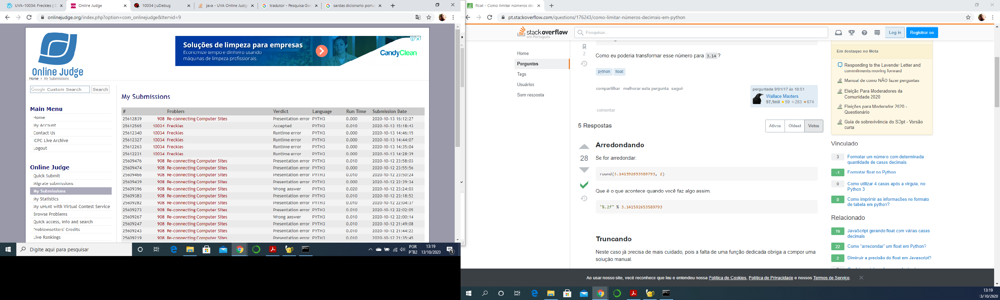

# Trabalho de Programação -- Algoritmos Gulosos -- Parte 4
**Autor:** Edimar Antonio da Cruz
**Data:** 13 de outubro de 2020
**Problema:** 00908 -- Re-connecting Computer Sites
## Sobre a Solução
Este diretório contém o código fonte gerado para solucionar o problema 00908
do *Online Judge*. O problema recebeu veredito \Presentation error	", como mostrado na
figura abaixo:

O programa foi desenvolvido em Python.
